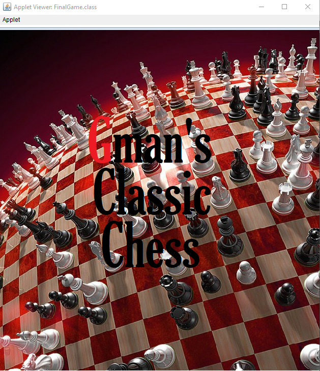
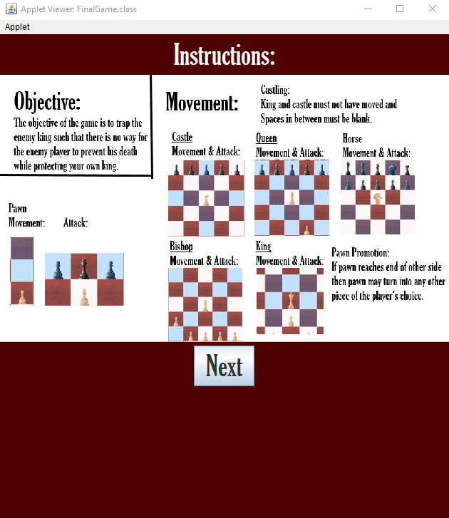
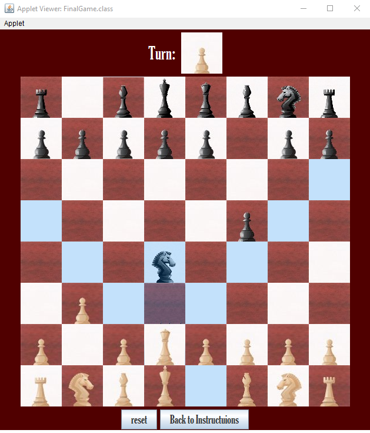
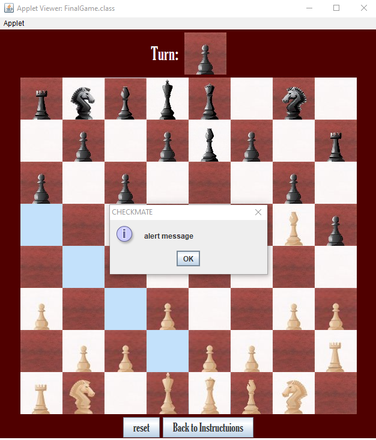

# Chess Game

#### This is a 2 player Graphical User Interface Chess program I created early in my programming career, before learning OOP, mainly to practice array manipulation. It includes a move generation algorithm that highlights all possible moves to guide beginner players and is programmed in Java with the Eclipse IDE.
#### [Link to Java code](https://github.com/GursherBaath/ChessGame/blob/master/FinalGame.java)
## User-Interface and Gameplay

